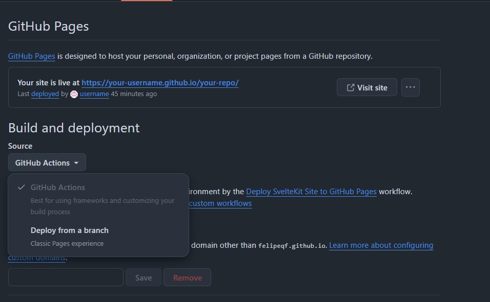

# Open Portfolio

A fully customizable, modern portfolio website built with **SvelteKit** and **TypeScript**. Create your professional portfolio by simply editing a single JSON configuration file - no coding required!

## 📚 Table of Contents

- [✨ Features](#-features)
- [🃏 Card Types](#-card-types)
  - [1. Cards](#1-cards-cards)
  - [2. Cards with Links](#2-cards-with-links-cards_with_link)
  - [3. Cards with Icons](#3-cards-with-icons-cards_with_icons)
  - [4. Cards Outside](#4-cards-outside-cards_outside)
- [🎨 Available Themes](#-available-themes)
- [🔧 JSON Configuration](#-json-configuration)
- [📂 Project Structure](#-project-structure)
- [🔄 Section Ordering & Management](#-section-ordering--management)
- [📁 Custom Pages](#-custom-pages)
  - [Creating a new Project](#creating-a-new-project)
  - [Creating Custom Pages](#creating-custom-pages)
  - [Adding Images to Markdown Content](#adding-images-to-markdown-content)
  - [Removing Custom Pages](#removing-custom-pages)
- [⚙️ Settings Configuration](#️-settings-configuration)
- [🚀 Getting Started](#-getting-started)
- [📦 Deployment on GitHub Pages](#-deployment-on-github-pages)
- [📄 License](#-license)
- [🤝 Contributing](#-contributing)
- [📧 Support](#-support)

## ✨ Features

- 🎨 **Multiple Themes**: 8 beautiful themes (4 light + 4 dark variants)
- 📱 **Fully Responsive**: Perfect on desktop, tablet, and mobile
- 🔧 **JSON-Driven**: Complete customization through `portfolio-data.json`
- 🃏 **4 Card Types**: Different layouts for various content types
- 📄 **Blog & Project Support**: Markdown-based content management
- 🚀 **Fast & Optimized**: Built with SvelteKit for optimal performance
- 📱 **Modern UI/UX**: Clean, professional design with smooth animations
- 📁 **Custom Pages**: Create unlimited custom sections with markdown content

## 🃏 Card Types

The portfolio supports four distinct card layouts, each with specific data requirements:

### 1. **Cards** (`cards`)

Basic cards for certifications, awards, or simple listings.

**Data Fields:**

- `title` _(required)_
- `organization` _(optional)_
- `date` _(optional)_
- `description` _(optional)_
- `link` _(optional)_
- `icon` _(optional)_

### 2. **Cards with Links** (`cards_with_link`)

Enhanced cards with prominent action buttons for experience and education.

**Data Fields:**

- `title` _(required)_
- `organization` _(optional)_
- `date` _(optional)_
- `description` _(optional)_
- `link` _(optional)_
- `icon` _(optional)_

### 3. **Cards with Icons** (`cards_with_icons`)

Specialized cards for skills and technical expertise with tag-based listings.

**Data Fields:**

- `name` _(required)_
- `skills` _(required)_ - Array of skill names
- `icon` _(optional)_

### 4. **Cards Outside** (`cards_outside`)

Dynamic cards that load content from markdown files.

**Configuration:**

- `path` _(required)_ - Directory path to markdown files
- `title` _(required)_ - Section title
- `type` _(required)_ - Must be "cards_outside"
- `truncation_limit` _(optional)_ - Character limit for descriptions

**Markdown File Requirements:**

- `title` _(required)_ - In frontmatter
- `description` _(optional)_ - In frontmatter
- `date` _(optional)_ - In frontmatter
- `tags` _(optional)_ - In frontmatter
- `link` _(optional)_ - In frontmatter
- `image` _(optional)_ - In frontmatter
- `skip` _(optional)_ - Boolean if True skip page and redirect to 'link'
- `display_order` _(optional)_

## 🎨 Available Themes

### Light Themes

- **Default Light**: Clean and professional
- **Ocean Light**: Blue oceanic tones
- **Forest Light**: Green nature-inspired
- **Sunset Light**: Warm red accents

### Dark Themes

- **Default Dark**: Elegant dark mode
- **Ocean Dark**: Deep blue darkness
- **Forest Dark**: Rich forest greens
- **Sunset Dark**: Dramatic red highlights

## 🔧 JSON Configuration

The entire portfolio is configured through `src/content/data/portfolio-data.json`. This single file controls everything from content to styling.

### JSON Architecture

```json
{
  "sections": [
    {
      "title": "Section Name",
      "type": "card_type",
      "content": [...],
      "truncation_limit": 150
    }
  ],
  "settings": {
    "name": "Your Name",
    "title": "Your Title",
    "bio": "Your bio...",
    "theme": "theme-name",
    "basePath": "/your-repo-name",
    "potrait_image": "path/to/image.png",
    "expertises": ["skill1", "skill2"],
    "cards_before_pagination": 3
  },
  "social": [
    {
      "name": "Platform",
      "link": "URL",
      "icon": "path/to/icon.svg"
    }
  ]
}
```

### Section Configuration

Each section in the `sections` array supports:

- **`title`**: Section heading _(required)_
- **`type`**: Card type (`cards`, `cards_with_link`, `cards_with_icons`, `cards_outside`) _(required)_
- **`content`**: Array of items (for static content) _(required for static types)_
- **`path`**: Directory path (for `cards_outside` type) _(required for cards_outside)_
- **`truncation_limit`**: Character limit for descriptions _(optional)_

### Content Structure by Card Type

#### For `cards` and `cards_with_link`:

```json
{
	"title": "Position/Title",
	"organization": "Company/Institution",
	"date": "Time period",
	"description": "Detailed description",
	"link": "https://example.com",
	"icon": "path/to/icon.svg"
}
```

#### For `cards_with_icons`:

```json
{
	"name": "Category Name",
	"icon": "path/to/icon.svg",
	"skills": ["skill1", "skill2", "skill3"]
}
```

#### For `cards_outside`:

```json
{
	"path": "src/content/projects/",
	"title": "Projects",
	"type": "cards_outside"
}
```

## 📂 Project Structure

```
src/
├── content/
│   ├── data/
│   │   └── portfolio-data.json    # Main configuration
│   ├── projects/                  # Markdown project files
│   ├── blogs/                     # Markdown blog files
│   └── custom-section/            # Custom section files (optional)
├── lib/
│   ├── components/
│   │   ├── sections/Cards/        # Card components
│   │   └── common/                # Shared components
│   └── utils/                     # Utility functions
├── routes/                        # SvelteKit routes
└── styles/                        # CSS and themes
```

## 🔄 Section Ordering & Management

### Adding Sections

Simply add a new object to the `sections` array in `portfolio-data.json`:

```json
{
  "sections": [
    {
      "title": "New Section",
      "type": "cards",
      "content": [...]
    }
  ]
}
```

### Removing Sections

Delete the corresponding object from the `sections` array.

### Reordering Sections

Change the order of objects in the `sections` array - the portfolio will automatically reflect the new order.

## 📁 Custom Pages

### Creating a new Project

**Add a project file**: `src/content/projects/my-app.md`

```markdown
---
title: 'My Mobile App'
description: 'A React Native app for task management'
date: '01-15-2024'
tags: ['React Native', 'Mobile', 'TypeScript']
link: 'https://github.com/username/my-app'
image: 'images/app-screenshot.png'
---

# My Mobile App

This is a comprehensive task management application built with React Native...


```

### Creating Custom Pages

You can create unlimited custom routes beyond projects and blogs:

1. **Create a new folder** in `src/content/` (e.g., `src/content/research/`)
2. **Add markdown files** with metadata to your folder
3. **Add images folder** (optional): Create an `images/` subfolder within your section folder
4. **Add the section** to your `portfolio-data.json`:
   ```json
   {
   	"path": "src/content/research/",
   	"title": "Research",
   	"type": "cards_outside",
   	"truncation_limit": 120
   }
   ```

The system will automatically discover and display all markdown files in your custom folder!

### Adding Images to Markdown Content

**Image Storage:**

- Create an `images/` folder inside your content section (e.g., `src/content/research/images/`)
- Place your images in this folder

**Using Images in Markdown:**

```markdown
---
title: 'My Research Project'
image: 'images/project-cover.jpg' # Displayed on card and page header
---

# My Research Project


```

**Image Display:**

- **Card Preview**: Adding `image` in frontmatter displays it on the card in the grid view
- **Page Header**: The same image appears as a header when opening the full page
- **Content Images**: Use standard markdown syntax for images within the content

### Removing Custom Pages

To delete a custom route section:

1. **Remove from JSON**: Delete the section object from `portfolio-data.json`
2. **Delete folder** (optional): Remove the entire content folder (e.g., `src/content/research/`)

**To remove individual pages** within a section:

- Simply delete the specific `.md` file from the folder
- The system will automatically update the section

## ⚙️ Settings Configuration

The `settings` object in `portfolio-data.json` controls global portfolio behavior, appearance, and metadata.

### Complete Settings Structure

```json
{
	"settings": {
		"name": "Your Full Name",
		"title": "Your Professional Title",
		"bio": "Your professional bio in markdown format",
		"theme": "light",
		"basePath": "/your-repo-name",
		"potrait_image": "images/your-photo.jpg",
		"expertises": ["skill1", "skill2", "skill3"],
		"cards_before_pagination": 3 # Number of cards displayed before pagination
	}
}
```

### Settings Breakdown

- **`name`** _(required)_ - Your full name displayed in navigation, footer, and about section
- **`title`** _(required)_ - Your professional title shown prominently in the about section
- **`bio`** _(required)_ - Your professional biography (supports markdown formatting)
- **`theme`** _(optional)_ - Select any of the 8 available themes (defaults to "light")
  - Light themes: `"light"`, `"ocean-light"`, `"forest-light"`, `"sunset-light"`
  - Dark themes: `"dark"`, `"ocean-dark"`, `"forest-dark"`, `"sunset-dark"`
- **`basePath`** _(optional)_ - **Required** for GitHub Pages deployment (use your repository name)
  - Local development: `""` (empty string)
  - GitHub Pages: `"/your-repository-name"`
- **`potrait_image`** _(required)_ - Path to your profile photo (place image in `static/images/`)
  - Example: Place `profile.jpg` in `static/images/` and use `"images/profile.jpg"`
- **`expertises`** _(optional)_ - Array of your key skills displayed as tags in the about section
  - Recommended: 4-8 skills for optimal visual balance
  - Example: `["JavaScript", "React", "Node.js", "Python"]`
- **`cards_before_pagination`** _(optional)_ - Number of cards shown before pagination (defaults to 3)

## 🚀 Getting Started

### Prerequisites

- Node.js 18+
- npm or yarn

### Installation

1. **Clone the repository**

   ```bash
   git clone https://github.com/yourusername/open-portfolio.git
   cd open-portfolio/front_end
   ```

2. **Install dependencies**

   ```bash
   npm install
   ```

3. **Configure your portfolio**
   Edit `src/content/data/portfolio-data.json` with your information

4. **Add your assets**

   - Place images in `static/images/`
   - Place icons in `static/icons/`
   - Add your resume as `static/CV.pdf`

5. **Run development server**
   ```bash
   npm run dev
   ```

## 📦 Deployment on GitHub Pages

### Automatic Deployment with GitHub Actions

The portfolio uses **GitHub Actions** for automatic deployment. Simply push your repository and it will deploy automatically!

### Step 1: Configure Repository Name

1. **Update `portfolio-data.json`**:

   ```json
   {
   	"settings": {
   		"basePath": "/your-repository-name"
   	}
   }
   ```

### Step 2: Push to GitHub

1. **Initialize and push your repository**:

   ```bash
   git add .
   git commit -m "Initial portfolio setup"
   git push origin main
   ```

2. **GitHub Actions will automatically**:
   - Build your portfolio
   - Deploy to GitHub Pages
   - Make it available at `https://yourusername.github.io/your-repository-name`

### Step 3: Enable GitHub Pages

1. Go to your repository **Settings**
2. Navigate to **Pages** section
3. Ensure source is set to **GitHub Actions**

That's it! Every time you push changes, your portfolio will automatically redeploy.

## 📄 License

This project is open source and available under the [MIT License](LICENSE).

## 🤝 Contributing

Contributions are welcome! Please feel free to submit a Pull Request.

## 📧 Support

If you have any questions or need help setting up your portfolio, please open an issue on GitHub.

---
